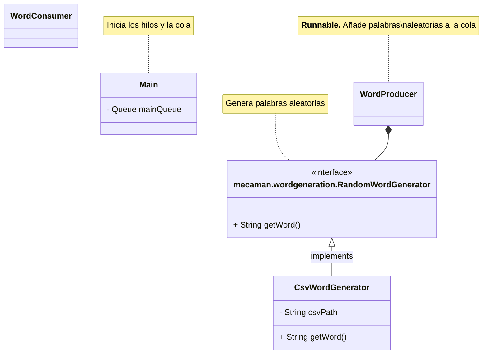

# Tareas

### 1. Ficha sobre la estructura utilizada (`ConcurrentLinkedQueue`)

Hay que hacer una ficha con información de la estructura que hemos elegido.

- [ ] Introducción (Ángel Robles)
    - ¿Qué es una cola?
    - ¿Para que sirve una cola?
- [ ] **Casos de uso** (Leo)
- [ ] Tabla con los **métodos** más relevantes (Ángel Contreras) (Ángel Robles)
    - [Documentación](https://docs.oracle.com/javase/8/docs/api/java/util/concurrent/ConcurrentLinkedQueue.html)

### 2. Proyecto Mecaman

- [ ] Clase `mecaman.wordgeneration.RandomWordGenerator` (Leo)
    - Escoge **palabras aleatorias** a partir de un fichero **csv** (`words.csv`)
    - `words.csv` contiene una lista de palabras comunes
    - Es más eficiente si carga todas las palabras en memoria al iniciarse el programa
- [ ] Clase `WordProducer`
- [ ] Clase `WordConsumer`

---

#### Log

> *Viernes, 12 de noviembre de 2023*:
> - Definir estructura del proyecto
> - Asignar tareas
> - Ficha de la estructura de datos

