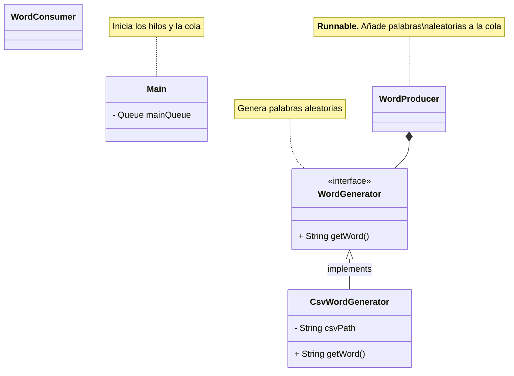

# Tareas

### 1. Ficha sobre la estructura utilizada (`ConcurrentLinkedQueue`)

Hay que hacer una ficha con información de la estructura que hemos elegido.

- [ ] **Casos de uso**
- [ ] Características de un **problema** que se puede resolver con esta estructura
- [ ] Tabla con los **métodos** más relevantes

> Especificar más cuando se publique la tarea

### 2. Proyecto Mecaman

- [ ] Clase `WordGenerator`
  - Escoge **palabras aleatorias** a partir de un fichero **csv** (`words.csv`)
  - `words.csv` contiene una lista de palabras comunes
  - Es más eficiente si carga todas las palabras en memoria al iniciarse el programa
- [ ] Clase `WordProducer`
- [ ] Clase `WordConsumer`

---

#### Log

> *Viernes, 12 de noviembre de 2023*: 
> - Definir estructura del proyecto
> - Asignar tareas
> - Ficha de la estructura de datos

