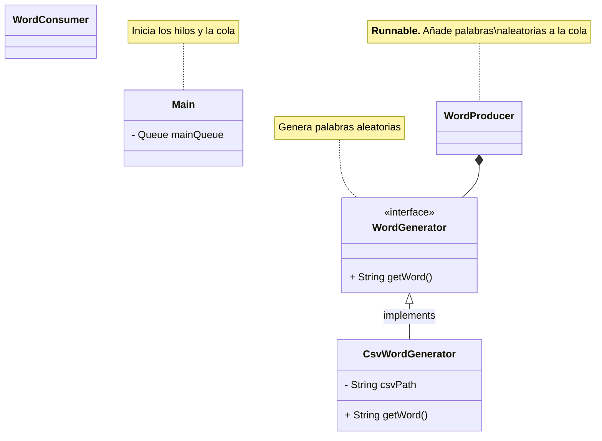

# Tareas

### 1. Ficha sobre la estructura utilizada (`ConcurrentLinkedQueue`)

Hay que hacer una ficha con información de la estructura que hemos elegido.

- [ ] Introducción (Ángel Robles)
    - ¿Qué es una cola?
    - ¿Para que sirve una cola?
- [ ] **Casos de uso** (Leo)
    - Características que tiene un problema para que pueda resolverse con esta estructura
        - No tiene que ser procesado inmediatamente, pero sí en su orden de llegada. Es decir, el primero que llega,
          primero que termina (FIFO).
        - Un recurso que se comparte con varios consumidores.
    - Ejemplos:
        - Servidor Web: Los servidores web utilizan colas para administrar las solicitudes entrantes de los clientes.
        - Colas de impresora: En los sistemas de impresión, las colas se utilizan para administrar el orden en que se
          procesan los trabajos de impresión. Los trabajos se agregan a la cola a medida que se envían, y la impresora
          los procesa en el orden en que se recibieron.
        - Protocolos de red: Los protocolos de red como TCP y UDP usan colas para administrar paquetes que se transmiten
          a través de la red. Las colas pueden ayudar a garantizar que los paquetes se entreguen en el orden correcto y
          a la tarifa adecuada.
- [ ] Tabla con los **métodos** más relevantes (Ángel Contreras)
    - [Documentación](https://docs.oracle.com/javase/8/docs/api/java/util/concurrent/ConcurrentLinkedQueue.html)

### 2. Proyecto Mecaman

- [ ] Clase `WordGenerator`
    - Escoge **palabras aleatorias** a partir de un fichero **csv** (`words.csv`)
    - `words.csv` contiene una lista de palabras comunes
    - Es más eficiente si carga todas las palabras en memoria al iniciarse el programa
- [ ] Clase `WordProducer`
- [ ] Clase `WordConsumer`

---

#### Log

> *Viernes, 12 de noviembre de 2023*:
> - Definir estructura del proyecto
> - Asignar tareas
> - Ficha de la estructura de datos

