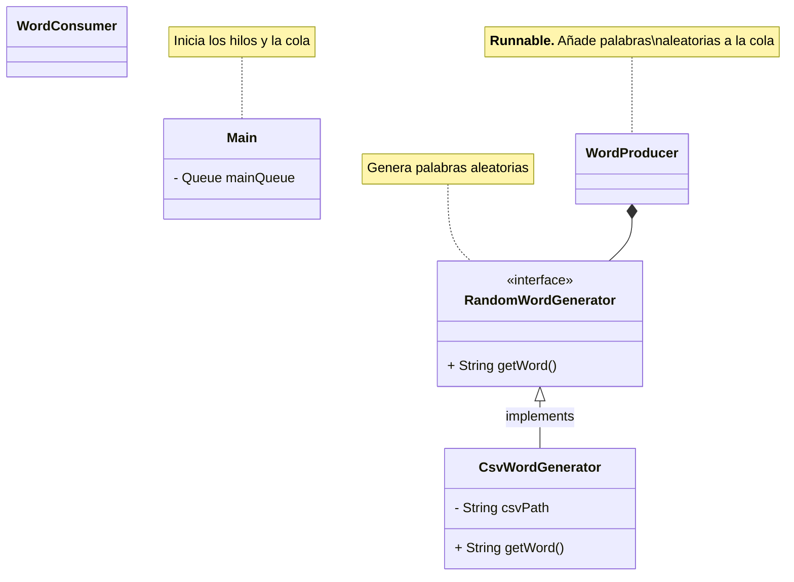

<h1 align="center"> Proyecto ConcurrentLinkedQueue (<i>Mecaman</i>)</h1>

```yaml
Módulo: Programación de servicios y procesos
Lenguaje: Java
Tema: Uso de estructuras concurrentes
Estructura Elegida: ConcurrentLinkedQueue
```


<div align="center">
  
</div>

<p align="center">
  <a href="#-descripción-del-proyecto">Descripción</a> •
  <a href="#-datos-de-concurrentlinkedqueue">Ficha de la estructura de datos</a> •
  <a href="#-ficheros-del-proyecto">Explicación de los ficheros del proyecto</a> •
  <a href="./collaboration.md">Trabajo en equipo</a>
</p>

## 📜 Descripción del proyecto

> ### ⌨ Integrantes del grupo
>
> - José Leonardo Ortega Pinto ([Leo0756](https://github.com/leo0756))
> - Ángel Robles Carrillo ([Arobles912](https://github.com/Arobles912))
> - Ángel Contreras Jimenez ([AngiePlaysOsu](https://github.com/AngiePlaysOsu))
> - Manuel Alejandro Cortés Carmona ([Iridescent1010](https://github.com/Iridescent100))
> - Martina Victoria López Quijada ([CakeNeka](https://github.com/cakeneka))

 ### ⚡ Mecaman
 
 Nuestra idea incial era hacer un juego de **mecanografía**. Teníamos un hilo
 que añadía palabras a una cola y otro que detectaba la entrada del usuario para
 eliminar la última palabra de la cola cuando el usuario la escribese.

 De esta forma solo había un hilo productor y otro consumidor. Como el patrón
 productor-consumidor suele tener en cuenta **varios hilos productores** y **varios
 hilos consumidores** finalmente decidimos hacer que la entrada del usuario fuera
 **simulada**, es decir, cada hilo consumidor elimina una palabra de la cola y espera
 una cantidad de milisegundos por cada letra que contenga la palabra eliminada.
 
 Para añadir algo de complejidad, el hilo consumidor también **invierte la palabra**
 que elimina de la cola antes de mostrarla por pantalla (por ejemplo de `Amor` a `romA`)
 y utilizamos un `ScheduledExecutorService` para ejecutar cada cierto tiempo un
 método que **controla la prioridad** de los hilos según el porcentaje de ocupación de la cola
 (Si el tamaño de la cola es más cercano al tamaño máximo, aumenta la prioridad de los consumidores.
 Si el tamaño de la cola es más cercano a 0, aumenta la prioridad de los productores)

 Parte del código ejecutado que ejecuta el **hilo productor**:
 
```java
// Aquí el hilo productor espera si no hay sitio en la cola para añadir más palabras
producerSemaphore.acquire();
String word = generateWord();
System.out.printf("%s añade %s\n", producer.getName(), word);
Thread.sleep((long) (Math.random() * 500)); // El hilo es suspendido entre 0 y 0.5 segundos
wordsQueue.add(word);
```

 Parte del código que ejecuta el **hilo consumidor**:

```java
// Aquí el hilo consumidor espera en caso de que la cola esté vacía
consumerSemaphore.acquire();
String word = wordsQueue.remove();

// Consumidor procesa palabra (le da la vuelta)
char[] reversedWordArray = new char[word.length()];
int j = word.length() - 1;
int i = 0;
while (j >= 0) {
    reversedWordArray[j--] = word.charAt(i++);
    Thread.sleep(20);
}
System.out.printf("%s escribe %s\n", consumer.getName(), new String(reversedWordArray));
```


## ⚙ Datos de `ConcurrentLinkedQueue`

### Introducción

Puees una estructura tal (prueba) leo, esto es una modificación desde la rama LEO

### Colas
 - Estructura de datos que almacena elementos en una lista antes de ser procesados y que permite acceder a los datos por uno de los dos extremos de la lista.
 - Los elementos de esta estructura suelen almacenar los elementos en forma *FIFO*.
 - Las colas proporcionan operaciones de inserción, extracción e inspección.
 - Las colas en Java se implementan como una *Interfaz*, que extienden de *Collection*.

### Casos de uso
  - Características que tiene un problema para que pueda resolverse con esta estructura
    - No tiene que ser procesado inmediatamente, pero sí en su orden de llegada. Es decir, el primero que llega, primero que termina (FIFO).
    - Un recurso que se comparte con varios consumidores.
  - Ejemplos:
    - Servidor Web: Los servidores web utilizan colas para administrar las solicitudes entrantes de los clientes.
    - Colas de impresora: En los sistemas de impresión, las colas se utilizan para administrar el orden en que se
      procesan los trabajos de impresión. Los trabajos se agregan a la cola a medida que se envían, y la impresora
      los procesa en el orden en que se recibieron.
    - Protocolos de red: Los protocolos de red como TCP y UDP usan colas para administrar paquetes que se transmiten
      a través de la red. Las colas pueden ayudar a garantizar que los paquetes se entreguen en el orden correcto y a la tarifa adecuada.

### Métodos de interés
| Metodo | Descripción | Tipo |
| --- | --- | --- |
| add(E e) | Inserta el elemento especificado al final de esta cola. | boolean | 
| clear() | Elimina todos los elementos de esta cola. | void | 
| element() | Recupera, pero no elimina, el encabezado (primer elemento) de esta cola. | E | 
| contains(Object o) | Devuelve true si esta cola contiene el elemento especificado. | boolean | 
| isEmpty() | Devuelve true si esta cola no contiene elementos. | boolean | 
| offer(E e) | Inserta el elemento especificado al final de esta cola. | boolean | 
| peek() | Recupera, pero no elimina, el encabezado (primer elemento) de esta cola. | E | 
| remove() | Recupera y elimina el encabezado (primer elemento) de esta cola. | E | 


## 📁 Ficheros del proyecto

> [!IMPORTANT]
> 
> #### Herramientas utilizadas
> 
> - **IDE:** IntelliJ IDEA Community
> - **JDK:** OpenJDK 21
> 
> ```
> Como punto de partida hemos utilizado ejemplos vistos en clase sobre el patrón productor - consumidor.
> ```

El código está organizado por **paquetes**. Utilizamos también un archivo de texto (`WordList.csv`)
para la generación de palabras aleatorias.

### Archivos de texto

<!-- Añadir archivos relacinados con el registro del tamaño de la cola -->
- [`resources/WordList.csv`](resources/WordList.csv) Lista con 130 palabras comunes
- [`readme.md`](readme.md) Explicación y descripción del proyecto
- [`collaboration.md`](collaboration.md) Para la organización del trabajo en equipo

### Archivos `.java`

##### Paquete `mecaman`

- [`Main.java`](src/mecaman/Main.java)
   - Instancia la estructura de datos (`ConcurrentLinkedQueue`)
   - Instancia la clase que controla la concurrencia (`WordManager`)
   - Instancia y lanza los hilos productores (`WordProducer`) y consumidores (`WordConsumer`)
   - Utiliza un `ScheduledExecutorService` para ejecutar repetidamente un método que controla la prioridad de productores y consumidores.
   - Finaliza la ejecución del programa después de un tiempo determinado

##### Paquete `mecaman.producerconsumer`

- [`WordManager.java`](src/mecaman/producerconsumer/WordManager.java)
  - Equivalente a `Almacen` en el ejemplo visto en clase.
  - controla la concurrencia y el tamaño máximo de la cola con objetos `Semaphore`.
- [`WordConsumer.java`](src/mecaman/producerconsumer/WordConsumer.java)
  - Hereda de la clase `Thread`
  - Mientras está activo, ejecuta el método `typeWord()` de `WordManager`
- [`WordProducer.java`](src/mecaman/producerconsumer/WordProducer.java)
  - Hereda de la clase `Thread`
  - Mientras está activo, ejecuta el método `addWord()` de `WordManager`
 
##### Paquete `mecaman.wordgeneration`

- [`RandomWordGenerator.java`](src/mecaman/wordgeneration/RandomWordGenerator.java)
  - Clase **singleton** (instancia única)
  - Lee el archivo de texto [`WordList.csv`](resources/WordList.csv) y almacena todas las palabras que contiene en una lista
    - Si el archivo no existe, informa del error y rellena la lista con unas palabras alternativas 
  - `getRandomWord()` devuelve una palabra aleatoria selecccionada entre las leídas anteriormente

### Diagrama de clases



---

<pre align="center">
___  ___ _____ _____   ___  ___  ___  ___   _   _ 
|  \/  ||  ___/  __ \ / _ \ |  \/  | / _ \ | \ | |
| .  . || |__ | /  \// /_\ \| .  . |/ /_\ \|  \| |
| |\/| ||  __|| |    |  _  || |\/| ||  _  || . ` |
| |  | || |___| \__/\| | | || |  | || | | || |\  |
\_|  |_/\____/ \____/\_| |_/\_|  |_/\_| |_/\_| \_/
</pre>
<p align="right"><sub>Texto hecho con <a href="https://patorjk.com/software/taag/" target="_blank">Text to ASCII Art</a></sub></p>
