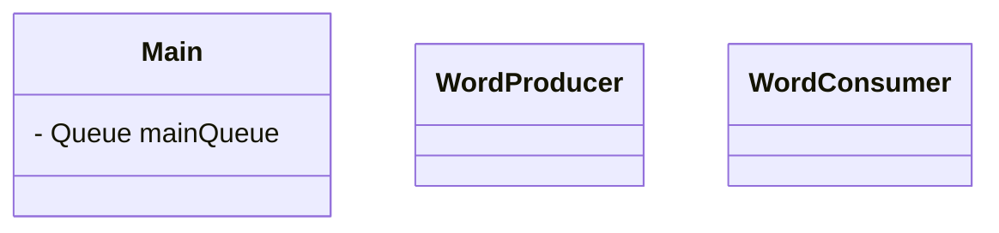

# Mecaman

### Descripción del proyecto

- Estructura de datos utilizada: `ConcurrentLinkedQueue`

#### Clases

- **`Main`**
- **`WordProducer`** (Hilos productores)
  - Selecciona palabras aleatorias fichero csv y las añade a `mainQueue`.
  - Podemos hacer que sea una interfaz y tener implementaciones como `nounProducer` o `verbProducer`
- **`WordConsumer`** (Hilos consumidores)
  - Sacan palabras de `mainQueue` y las procesan

    

### [Organización (trabajo en equipo)](collaboration.md)

---

> ### Desarrollado por
>
> - José Leonardo Ortega Pinto ([Leo0756](https://github.com/leo0756))
> - Martina López Quijada ([CakeNeka](https://github.com/cakeneka))
> - Ángel Robles Carrillo ([Arobles912](https://github.com/Arobles912))
> - Ángel Contreras Jimenez ([AngiePlaysOsu](https://github.com/AngiePlaysOsu))
